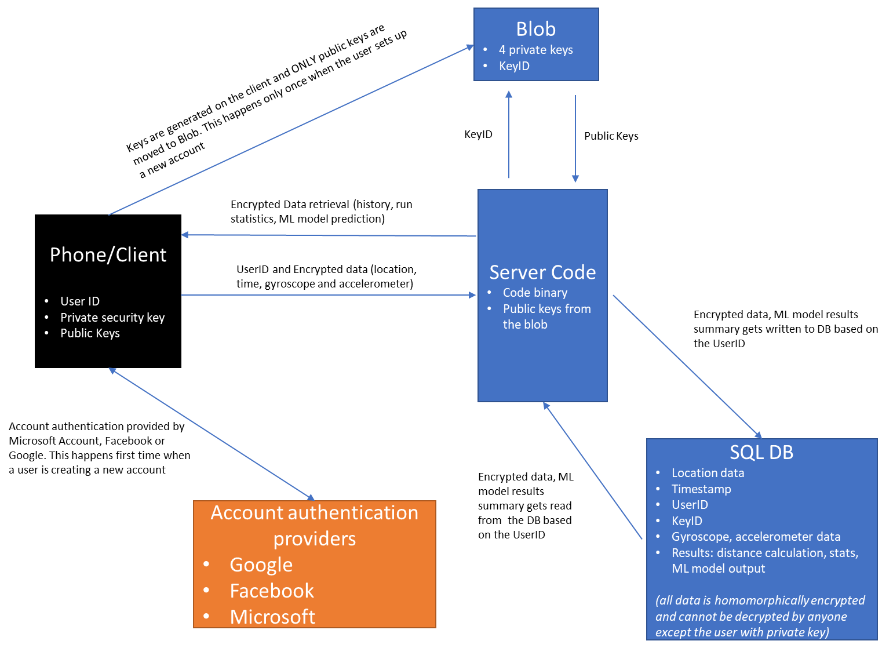

# AsureRun

AsureRun is a sample Android app developed to showcase Microsoft SEAL's homomorphic encryption capabilities.
It tracks the user's running data such as location, accelerometer, and gyroscope data and uses a
machine learning model to determine the intensity of the run. The app uses Microsoft SEAL to
encrypt the data, send it up to the server where it will apply the ML model on the encrypted data
without knowing the secret key, and send back the results of calculations encrypted for the client to
decrypt. The cloud service never decrypts the data. The server is also included, written in C#
and designed to run on Azure.

For more information about the Microsoft SEAL project, see [http://sealcrypto.org](https://www.microsoft.com/en-us/research/project/microsoft-seal).

# License

Microsoft SEAL is licensed under the MIT license; see [LICENSE](LICENSE).

# Contents
- [Building the App](#building-the-app) 
  - [Setup an Azure account](#setup-an-azure-account)
    - [Azure resources required](#azure-resources-required)
  - [Building the server](#building-the-server)
  - [Building the client](#building-the-client)
    - [Get Android Studio](#get-android-studio)
    - [Setup gradle properties](#setup-gradle-properties)
    - [Run the app](#run-the-app)
- [Architecture of the App](architecture-of-the-app)

# Building the App 
## Setup an Azure account

Get a free Azure account at [https://azure.microsoft.com/en-us/](https://azure.microsoft.com/en-us/).
Login to the Azure Portal. Though the account is free, some of the required resources may not be.

### Azure resources required

AsureRun requires a SQL server, SQL database, a storage account, and an app service to run. Select
'Create a resource' in the left menu.

##### Create an app service

Under 'Azure Marketplace' go to Mobile->Mobile App. Enter a name for the app. Choose an app service
plan or create a new one. Click 'Create'.

##### Create a SQL database

Under 'Azure Marketplace' go to Databases->SQL Database. Choose the same resource group as the app
service from before. Give the database a name and choose or create a server. Click Review + create.

##### Create a storage account

Under 'Azure Marketplace' go to Storage->Storage account. Choose the same resource group the app
service from before. Give the storage account a name and choose or create a server. Click 'Review +
create'.

## Building the server

##### Get Visual Studio

You need Visual Studio to build the server. Only VS2017 Enterprise edition was used to develop and
test. Other versions haven't been tested, so try at your own risk. Download it at [https://visualstudio.microsoft.com/downloads/](https://visualstudio.microsoft.com/downloads/).

##### Compile the solution

Navigate to Server\AsureRun_Runtime and open AsureRun.sln. Set build configuration to release and
platform to x64.

##### Setup publish profile

Open up the server explorer. If not visible it's under View->Server Explorer. It should prompt you
to log in, but if not right-click on Azure and click on 'Connect to Microsoft Azure Subscription'.
Log in with your credentials. You should see the name of the app service from the Azure resource
creation steps before.

##### Publish to Azure

Open up the solution explorer. Right-click on the solution and click 'Publish'. Click 'New
Profile...', choose 'Select Existing', click 'Publish', and it should fail due to failure to find
SEALWrapper.dll. Click 'Configure', select 'Settings' on the left side, and change configuration to
'Release - x64'. Click 'Save'. Click 'Publish'. A blue website with a happy face should appear if
all is well.

## Building the client

### Get Android Studio

You need Android Studio to build the mobile app. Download it at [https://developer.android.com/studio/](https://developer.android.com/studio/).

##### Install the necessary tools

After downloading it install it and run it. Go to Tools->SDK Manager. On the left select Android
SDK. Select the SDK Tools tab. Check the boxes next to CMake, LLDB, and NDK. Press OK to install
these tools. You are now set to build the app.

### Setup gradle properties

The app relies on a few properties that must be defined in gradle.properties, either the
project-wide one or the global one. Here's the following properties that must be defined:

-service_url_dev=https://your-website-dev.azurewebsites.net
-service_url=https://your-website.azurewebsites.net
-maps_key=your-google-maps-key
-microsoft_client_id=your-microsoft-client-id
-google_client_id=your-google-client-id-which-is-not-the-same-as-maps-key
-facebook_app_id=your-facebook-app-id
-app_center_secret_key=your-app-center-secret-key

##### Google Maps key

Follow the instructions here [https://developers.google.com/maps/documentation/android-sdk/start](https://developers.google.com/maps/documentation/android-sdk/start)

##### Microsoft client ID

Follow the instructions here [https://docs.microsoft.com/en-us/azure/app-service/configure-authentication-provider-microsoft](https://docs.microsoft.com/en-us/azure/app-service/configure-authentication-provider-microsoft)

##### Google client ID

Follow the instructions here [https://developers.google.com/identity/sign-in/android/start-integrating](https://developers.google.com/identity/sign-in/android/start-integrating)

##### Facebook app ID

Follow the instructions here [https://developers.facebook.com/docs/facebook-login/android](https://developers.facebook.com/docs/facebook-login/android)

##### App Center secret key

Register your app on App Center at [https://appcenter.ms](https://appcenter.ms). Visual Studio App Center is used to Build, Test and Distribute applications. Once the app's deployed, developers monitor the status and usage of the app using the Analytics and Diagnostics services.  

### Run the app

If everything was setup correctly the app should show a splash screen. Log in with any of the three
authenticators, and start running around!

# Architecture of the App 

## Data Capture on Phone/Client 

When using the app, the client performs the following actions:

1) On the Phone, the fitness app generates five security keys to encrypt the data including four public keys and one private key. Public keys are transferred to the Azure Blob and the private key always stays on the phone. This step occurs only _once_ when a user sets up a new account.
2) Starting a run, the fitness app captures the following user data – location coordinates (X,Y and Z), time (T), Gyroscope (X,Y,Z components) and Accelerometer (X,Y,Z components). Once a run is done, the fitness app encrypts this data using the security keys and packs them into ciphers as follows:
    - Cipher1 contains the x and y coordinates. Cipher1 has this format: (x1, x2,… xn), (y1, y2,… yn).
    - Cipher2 contains the z and t coordinates. Cipher2 has this format: (z1, z2,… zn), (t1, t2,… tn). 
     - CipherGyro has gyroscope X, Y, and Z coordinates and accelerometer X, Y, and Z coordinates. The average of each coordinate is encrypted, so the cipher contains the average of gyroscope's and accelerometer's  values. 
    - CipherEP has elevation gain and average pace deltas. CipherEP has this format: (E1, E2,… En), (P1, P2,… Pn).
     - CipherThumbnail contains a snapshot of the map at the end of the run.
3) The encrypted data is moved to the server.

## Data Processing on Azure/Server

The server performs following computations on the five encrypted ciphers:

1) Distance calculation:
    - The delta distances (i.e., &#916;x, &#916;y and &#916;z), are computed for each subsequent pair of X, Y and Z. The deltas are combined to calculate square of total distance travelled. The values associated with these calculations are stored in the stats cipher. The square root operation cannot be conducted on encrypted data, so that step is done on the client.
2) Summary statistics calculations:
    - We perform the following summary statistics – date, total number of runs, total distance and total hours associated with the runs – on the server. These values are stored in the summary cipher. The date is stored in the format of years after the year 2000, day of the week, week of the year, day of the year. This means the first 100 slots (handles up to 100 years after 2000) plus 7 (7 days in a single week) plus 53 (weeks in a year) plus 366 (days in a leap year) slots of the summary cipher are reserved for the date, each slot being zero or one to represent the date. After the date is the sum of the elevation gains.
3) Machine Learning model inference:
    - We use a linear regression model to classify the user workout. The weights associated with the model are hard-coded in the code (Weights stored as &quot;tensorB&quot;). The final model output is stored as &quot;m\_mlCipherBase64&quot;

## Data Processing on Phone/ Client

The server passed encrypted finished and semi-finished outputs to the client that decrypts them using the private key and either performs additional computation on it or simply displays them for the user:

1) Distance calculation:
    - The client takes the square of the distances calculated on the server in the stats cipher, decrypts it, performs the square root operation on it, and sums it all up to calculate the final distance (stored as &quot;distance&quot;)
    - This computed distance is then displayed for the user
2) Summary statistics calculations:
    - Client decrypts – total number of runs, total distance and total hours associated with the runs. These values are stored in variables (mTotalDistanceKm, mTotalTimeSec) and displayed for the user
    - Client computes the average pace (mTotalDistanceKm / mTotalTimeSec) based on time and distance values and displays it to the user
3) Machine Learning model inference:
     - The final model output &quot;intensity&quot; is decrypted and a simple threshold is applied to this decrypted value to classify the workout. More information on the threshold:
       - Value greater than 0.3 is classified as low intensity
       - Value between 0.1 and 0.3 is classified as medium intensity
       - Value less than 0.1 is classified as high intensity